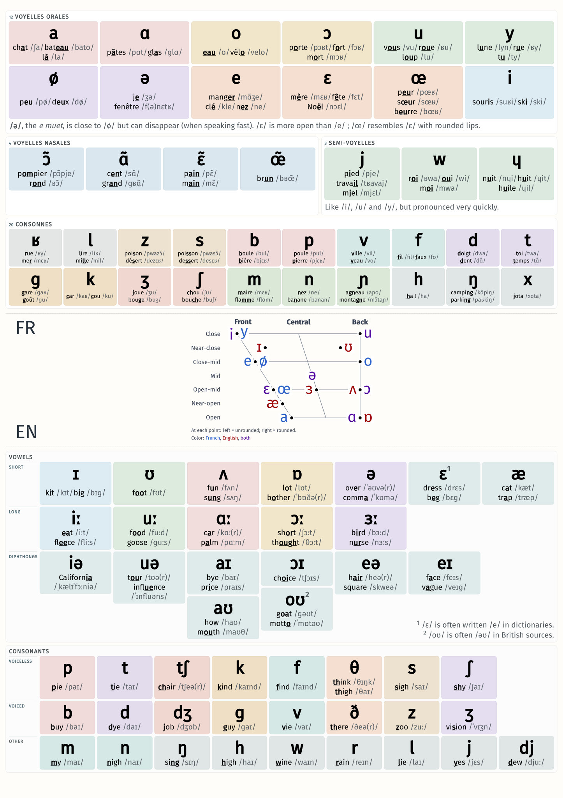

# IPA Poster

A French-English IPA poster for language learners: [pdf](./poster.pdf)



A great YouTube video that I learned from:
- [🎯 Master all French sounds | Improve your pronunciation 😄](https://youtu.be/JRar2PsgArg?si=fhrsgWe3-mY6Nxom) by [@professeurfrancais_guillaume](https://www.youtube.com/@professeurfrancais_guillaume)

## Building

Compiling the vowel-position-reference diagram to pdf:
```bash
xelatex french-english-vowels.tex
```

Convert the pdf to svg:
```bash
inkscape --without-gui --file=french-english-vowels.pdf --export-plain-svg=french-english-vowels.svg
```

View the poster on browser:
```bash
python3 -m http.server -d .
```
